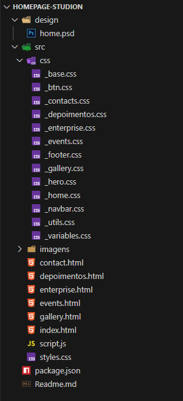

# 🏠 Homepage-Studion

**Homepage-Studion** é um projeto de estudo focado no desenvolvimento de uma página inicial utilizando **HTML5**, **CSS3** e **JavaScript**. O objetivo principal é praticar e aprimorar habilidades em construção de layouts responsivos e organização de código front-end.

---

## 📖 Sobre o projeto

Este projeto consiste em uma página inicial simples, desenvolvida como parte de um estudo prático. A página inclui:

- Estrutura semântica com HTML5
- Estilização responsiva utilizando CSS3
- Interatividade básica com JavaScript
- Organização modular de arquivos

---

## 🚀 Demonstração

🔗 **Acesse o projeto online:** [Clique aqui para visualizar](https://wellingtonlimaa.github.io/Homepage-Studion/)  

---

## 🧩 Tecnologias utilizadas

- **HTML5**: Estrutura semântica da página
- **CSS3**: Estilização e layout responsivo
- **JavaScript**: Interatividade e manipulação de elementos
- **Git & GitHub**: Controle de versão e hospedagem do código

---

## 📂 Estrutura do projeto

